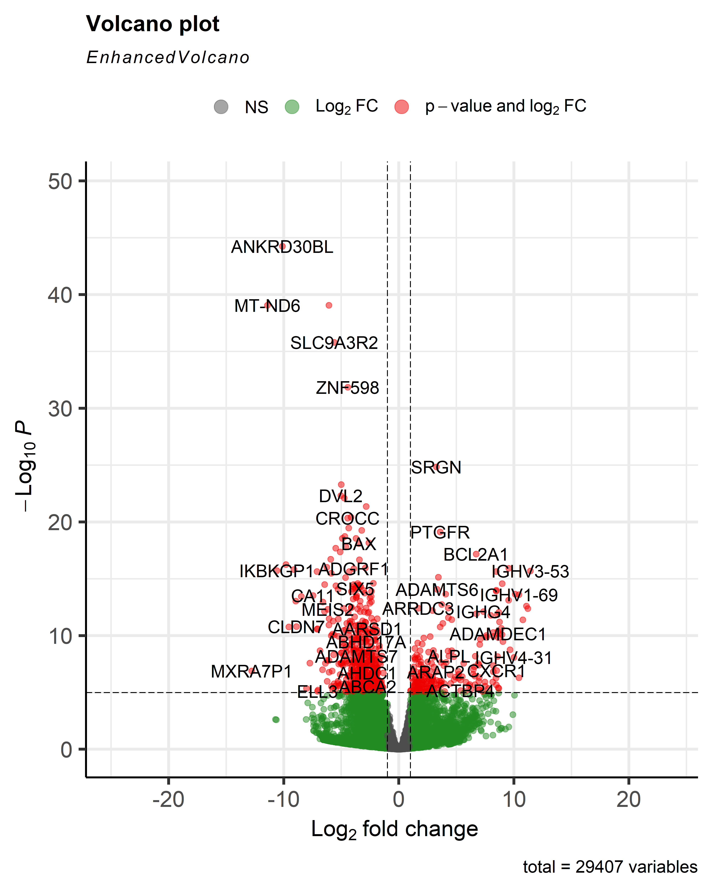
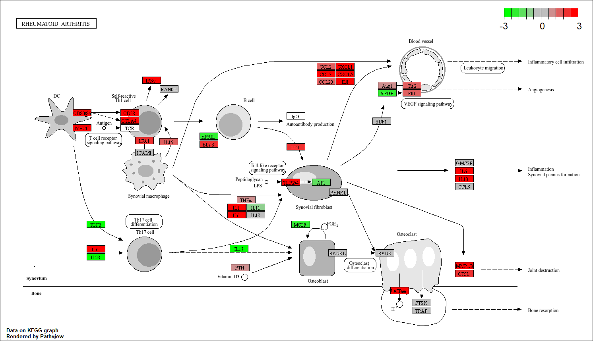
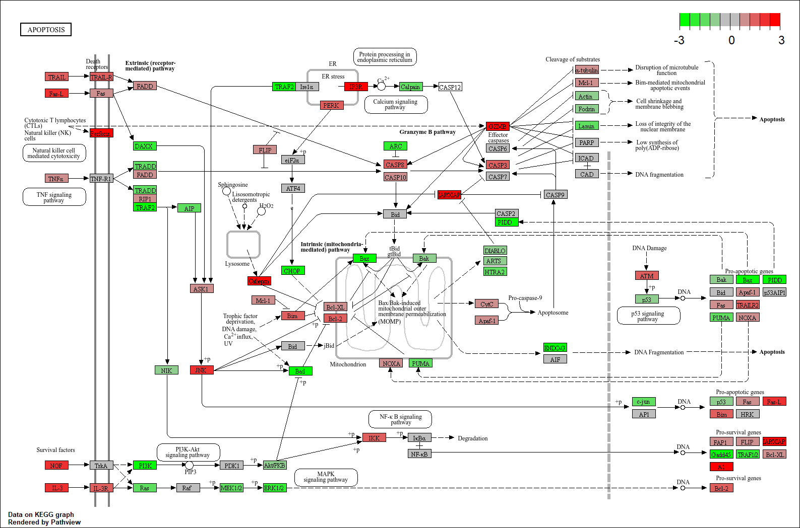

  

## Reumatoïde arthritis casus - Transcriptomics 
 Door: Haye Hoeksema
 
**Inleiding:**
Reumatoïde artritis (RA) is een systemische auto-immuunziekte die chronische ontsteking ontwaakt in de gewrichten. Pathologische veranderingen aan de structuur van het synoviaal stroma, dat zich bekleed aan de binnenkant van het gewricht kunnen hierdoor ontstaan. B-cellen, macrofagen, CD4+-cellen en verschillende onstekingsvormende cytokinen zoals Tumor Necrosis Factor (TNF) en Prostaglandine E2 (PGE2) komen bij deze patiënten veel voor in het gewrichtsslijmvlies wat kan lijden tot aanhoudende onsteking en zwelling. RA komt 3-5 keer vaker voor bij vrouwen dan bij mannen en is nog niet te genezen, maar wel te onderdrukken met NSAIDS (nonsteroidal anti-inflammatory drugs) en DMARDS (disease-modifying antirheumatic drugs). Voor onderdrukking van de symptomen wordt er wel zorgen gemaakt over de veiligheid, kosten en respons van de medicatie (Jiang et al., 2025; Singh et al., 2016; Yelin et al., 2017). Hierdoor zou meer informatie over het onstaan van de ziekte veel helpen om ooit genezing mogelijk te maken. 
Van vier mensen met RA en vier mensen zonder RA zijn er samples genomen van het gewrichtslijmvlies (synoviumbiopt), waarbij een Transcriptomics analyse is van uitgevoerd in R. Zo zal er gekeken worden naar verschillende  genen en pathways die (meer/minder) betrokken zijn bij RA vergeleken met gezonde mensen. 

**Refseq van NCBI in R toepassen**

  

*Figuur 1: Flowschema van protocol voor dit onderzoek.*

Vier mensen met RA zijn postief getest op auto-antistoffen ACPA en CCP met een diagnose van >12 maanden en Vier mensen waren negatief (controle). Rauwe data van de samples was al verkregen en een kwaliteitscontrole was gedaan. Deze sequenties werden gemapped tegen het menselijk referentiegenoom "Homo_sapiens.GRCh38.dna.toplevel.fa.g" van ENSEMBL, door een index van de verkregen forward -en reverse reads van de samples te vormen. Deze gelijnde reads werden als .BAM bestanden opgeslagen en vervolgens gesorteerd tot één bestand *(Packages: 7, 8 in citatielijst)*. Van de gesorteerde BAM-bestanden was een matrix gevormd waarin de gemapte reads waren geteld en op kaart gebracht in een aangemaakt data-frame. Hierna werd de volledige sample-data in een count-matrix verkregen. Uit de count-matrix waren de genen met hun naam en counts apart gezet in een nieuw data-frame om daarna in een volcanoplot geplot te worden, waarin interessante levels van significantie en verhoging/verlaging van expressie te zien zijn (sig = <= 0.5, expressie >= 1.5 keer verhoogd/verlaagd). Als laatste werd een "GO enrichment" en "Gene testing" uitgevoerd via Gene Ontology, om de pathways van alle gemapte genen te weergeven en de relevante pathways met biologische significantie via kegg.jp (Kyoto Encyclopedia of Genes and Genomes) *(Packages: alles in citatielijst)*

**Verschillende genen omhoog-en omlaag-gereguleerd bij RA:**
Voor het onderzoeken van de expressie van RA, was er een Refseq uitgevoerd bij controle als behandelingssamples uitgevoerd en dit gemapt op het menselijk genoom. Hiervoor zijn p-waardes berekent (significant = 0.05) en als volgt een volcanoplot, gene enrichment, pathway enrichment en twee KEGG pathway-maps gevormd en onderzocht. Bij volcano plot was te zien dat het gen "IGHV3-53" het hoogst gereguleerd was in expressie met een log2 Fold Change van 11.43 met een ifcSE van 1.28 (p = 3.514037e-19 padj = 2.060776e-16, methode = Benjamini-Hochberg). Verder bevat het gen BCL2A1 een log2 Fold Change van 6.71 met een ifcSE 0.72 van ((p = 8.124928e-21, padj = 6.750123e-18, methode = Benjamini-Hochberg) figuur 2)). Voor de gene enrichment was te zien dat de meest voorkomende afkomst qua soort bioproces in de RA omhoog-gereguleerde genen "protein binding" is ((bijna verdubbeld in aantal vergeleken met het bioproces op plaats 2) figuur 3 )). Voor de pathway enrichment bestond de top 10 soorten meest up-gereguleerde genen uit alleen immunologische pathways, met GOBP_ADAPTIVE_IMMUNE_RESPONSE en GOBP_IMMUNOGLOBLIN_PRODUCTION als de koplopers (figuur 4). Er was een pathway gevonden op KEGG.jp die gebaseerd was op RA. Hierin was vooral een duidelijke up-regulatie (3X) bij de genen van de dendrietcel, wat genen van de zelf-reactieve th1 cel, twee genen bij de synoviumvervorming, een gen bij botresorptie, een gen bij ontsteking en vier van de zes genen bij infiltratie van ontstekingscellen. Bij de apoptose pathway was er 3x meer expressie aanwezig bij BCL2A1, IAP/XIAP, IP3R perforin als GZMB in de Granzyme B pathway (figuur 5,6).        

  

*Figuur 2: Volcanoplot voor het aantonen van omhoog-en omlaag-gereguleerde genen met bepaalde biologische-en/of statistische significantie (groen = biologisch significant, rood is biologsich als statistisch significant, grijs = geen van beide, negatieve log-waarde = omlaag-gereguleerd en vice versa).*

  

*Figuur 3: GO enrichment van algemene vertakkingen van bioproces-pathways die omhoog-gereguleerde expressie tonen bij RA (BP, p < 0.05).*

  

*Figuur 4: GO enrichment op specifieke pathways gebaseerd op de meest omhoog-gereguleerde genen bij RA (BP, p < 0.05).*

  

*Figuur 5: Beeld van laag, hoog-gereguleerde-en neutrale expressie (geen verhoging of verlaging) bij RA pathway (hsa05323, KEGG.jp, p <0.05).*

  

*Figuur 6: Beeld van laag, hoog-gereguleerde-en neutrale expressie (geen verhoging of verlaging) bij apoptose pathway (hsa04210+597, KEGG.jp, p <0.05).*

**Naast versterkte apoptose ook IL6 een belangrijk gen:** 
Veel genen raken bij RA significant betrokken door omhoog of omlaag-regeguleerd te worden volgens de volcanoplot. Verder worden er verschillende, immunologische genen als pathways omhoog gereguleerd bij RA, waarop vooral eiwitbinding ontstaat. Naast de algemene RA pathway map in KEGG.jp, was er ook een statistische als biologische significantie bij de apoptose pathway map. Naast een verhoging van een paar genen betrokken bij ontsteking en beschadiging van de gewrichtsstructuur is er ook een significante, expressionele verhoging (3x) aan verschillende genen (zoals BCL2A1) die betrokken zijn bij apoptose. Hierop kan verder volgense de resultaten aangeduidt worden dat geamplificeerde apoptose door het overwerkend immuunsysteem een sterk gevolg is van RA. Volgens (Yoshida & Tanaka, 2014) is er al veel bekend over de hoofdrolspelers bij de vorming van RA. Onder anderen IL6 (Interleukine 6) blijkt bij citrullinisatie veel overwerkende functies door te geven aan T-en B-cellen, waardoor ontsteking wordt versterkt. Hiervoor bestaat al een veilig-geteste DMARD voor, die in meer dan honderd landen beschikbaar is. Verder is bekend dat BCL2A1 bij apoptose sterk verhoogd (3x) is bij RA. Volgens (Vogler, 2012) zou BCL2A1 bekend staan om het hoog of laag reguleren van de apoptose. Hierdoor zou het mogelijk kunnen zijn dat er bij RA (ter overleving van de overwerkte leukocyten) BCL2A1 de doding van immuuncellen probeert te minimaliseren. Hiervoor zou meer onderzoek naar gedaan kunnen worden, door te kijken naar meerdere gerelateerde pathways en patiëntensamples.  
