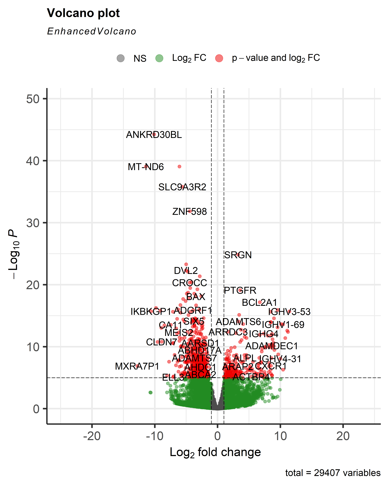
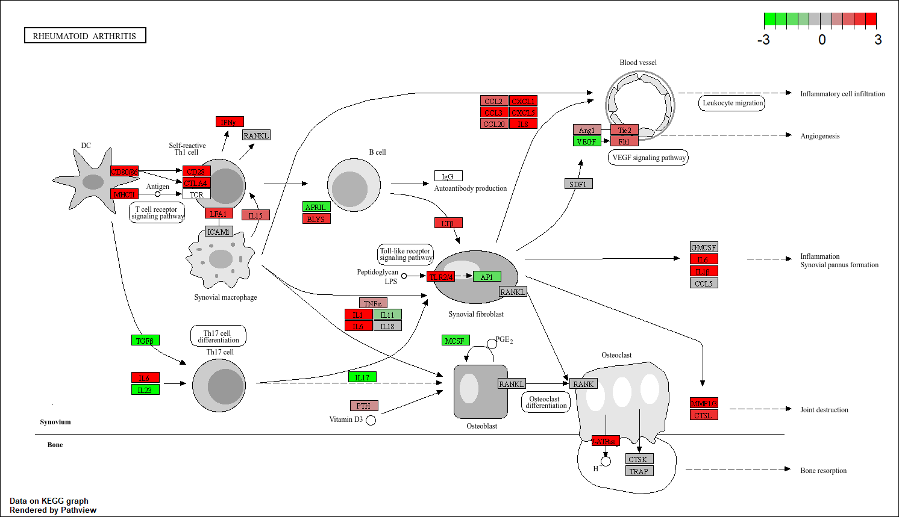
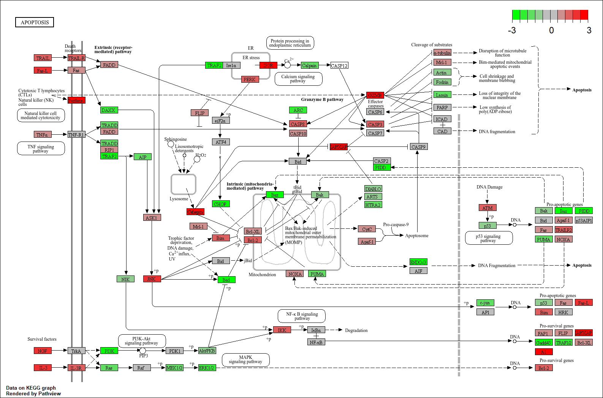

  

## Geamplificeerde genexpressie bij IL-6 en BCL2A1 binnen RA/apoptose-pathways in associatie met reumatoïde artritis-patiënten 
 Door: Haye Hoeksema, BML2C
 
**Inleiding**

Reumatoïde artritis (RA) is een systemische auto-immuunziekte die chronische ontsteking ontwaakt in de gewrichten. Pathologische veranderingen aan de structuur (bekleed aan de binnenkant van het gewricht). B-cellen, macrofagen, CD4+-cellen en verschillende onstekingsvormende cytokinen zoals Tumor Necrosis Factor (TNF) en Prostaglandine E2 (PGE2) komen bij deze patiënten veel voor in het gewrichtsslijmvlies wat kan lijden tot aanhoudende onsteking en zwelling. RA komt 3-5 keer vaker voor bij vrouwen dan bij mannen en is nog niet te genezen, maar wel te onderdrukken met NSAIDS (nonsteroidal anti-inflammatory drugs) en DMARDS (disease-modifying antirheumatic drugs). Over deze symptomen-onderdrukking wordt er wel qua veiligheid, kosten en medicatierespons zorgen gemaakt ([Jiang et al.,2025](Bronnen/Brown%20adipocyte%20exosome%20derived%20C22%206%20inhibits%20the%20IL%201β%20signaling%20pathway%20to%20alleviate%20rheumatoid%20arthritis.pdf); [Singh et al., 2016](Bronnen/Arthritis%20Care%20%20%20Research%20-%202015%20-%20Singh%20-%202015%20American%20College%20of%20Rheumatology%20Guideline%20for%20the%20Treatment%20of%20Rheumatoid.pdf); [Yelin et al., 2017](Bronnen/A%20Prospective%20Study%20of%20the%20Impact%20of%20Current%20Poverty%2C%20History%20of%20Poverty%2C%20and%20Exiting%20Poverty%20on%20Accumulation%20of%20Disease%20Damage%20in%20Systemic%20Lupus%20Erythematosus.pdf)). Hierdoor zou meer informatie over het onstaan van de ziekte veel helpen om ooit genezing mogelijk te maken. 
Van vier mensen met RA en vier mensen zonder RA zijn er samples genomen van het gewrichtsslijmvlies (synoviumbiopt), waarbij een Transcriptomics analyse is van uitgevoerd in R. Hiermee kan het gehele transcriptoom in beeld gelegd worden en kan er gekeken worden naar verschillende genen en pathways die (meer/minder) betrokken zijn bij RA vergeleken met gezonde mensen. Hierbij de vraag of er gekeken kan worden naar verschillen in genexpressies bij RA patiënten en mensen zonder RA. Daarnaast is er de vraag welke pathways biologisch significant zijn bij deze verschillen.  

**Refseq van NCBI in R toepassen**

  

*Figuur 1: Flowschema van protocol voor dit onderzoek.*

Vier mensen met RA zijn postief getest op auto-antistoffen ACPA en CCP met een diagnose van >12 maanden en vier mensen waren negatief (controle). Rauwe data van de samples waren al verkregen en een kwaliteitscontrole was hierop uitgevoerd. Deze sequenties werden gemapped tegen het menselijk referentiegenoom "Homo_sapiens.GRCh38.dna.toplevel.fa.g" van ENSEMBL, in een index van forward-en reverse reads. Vervolgens werden reads als .BAM bestanden opgeslagen en gesorteerd (*[Packages: 7, 8 in citatielijst](Bronnen/Packages_citatie_lijst.md)*). De BAM-bestanden werden in een matrix gevormd, waarin de gemapte reads waren geteld en op kaart gebracht in een aangemaakt data-frame, wat dus een count-matrix werd. Hierin werden genen met hun naam en counts apart gezet om in een volcanoplot geplot te worden, waarin biologische-en statistische significantie te zien is bij verhoogde, verlaagde en neutrale expressie (sig = <= 0.5, expressie, bio.sig >= 1.5 keer verhoogd/verlaagd). Als laatste werd een "GO enrichment" en "Gene testing" uitgevoerd via Gene Ontology, om de pathways van alle gemapte genen te weergeven en de relevante pathways met biologische significantie via kegg.jp (Kyoto Encyclopedia of Genes and Genomes) in te kleuren (*[Packages: Alles in citatielijst](Bronnen/Packages_citatie_lijst.md)*).

**Verschillende genen omhoog-en omlaag-gereguleerd bij RA**

Voor het onderzoeken van de expressie van RA, was er een Refseq uitgevoerd bij controle als behandelingssamples uitgevoerd en dit gemapt op het menselijk genoom. Hiervoor zijn p-waardes berekent (significant = 0.05) en als volgt een volcanoplot, gene enrichment, pathway enrichment en twee KEGG pathway-maps gevormd en onderzocht. Bij volcano plot was te zien dat het gen "IGHV3-53" het hoogst gereguleerd was in expressie met een log2 Fold Change van 11.43 met een ifcSE van 1.28 (p = 3.514037e-19 padj = 2.060776e-16, methode = Benjamini-Hochberg). Verder bevat het gen BCL2A1 een log2 Fold Change van 6.71 met een ifcSE van 0.72 ((p = 8.124928e-21, padj = 6.750123e-18, methode = Benjamini-Hochberg) figuur 2)). Voor de gene enrichment was te zien dat de meest voorkomende afkomst qua soort bioproces in de RA omhoog-gereguleerde genen "protein binding" is ((bijna verdubbeld in aantal vergeleken met het bioproces op plaats 2) figuur 3 )). Voor de pathway enrichment bestond de top 10 soorten meest up-gereguleerde genen uit alleen immunologische pathways, met GOBP_ADAPTIVE_IMMUNE_RESPONSE en GOBP_IMMUNOGLOBLIN_PRODUCTION als de koplopers (figuur 4). Er was een pathway gevonden op KEGG.jp die gebaseerd was op RA. Hierin was vooral een duidelijke up-regulatie (3X) bij de genen van de dendrietcel, wat genen van de zelf-reactieve th1 cel, twee genen bij de synoviumvervorming, een gen bij botresorptie, een gen bij ontsteking en vier van de zes genen bij infiltratie van ontstekingscellen. Bij de apoptose pathway was er 3x meer expressie aanwezig bij BCL2A1, IAP/XIAP, IP3R perforin als GZMB in de Granzyme B pathway (figuur 5,6).        

  

*Figuur 2: Volcanoplot voor het aantonen van omhoog-en omlaag-gereguleerde genen met bepaalde biologische-en/of statistische significantie (groen = biologisch significant, rood is biologsich als statistisch significant, grijs = geen van beide, negatieve log-waarde = omlaag-gereguleerd en vice versa).*

  

*Figuur 3: GO enrichment van algemene vertakkingen van bioproces-pathways die omhoog-gereguleerde expressie tonen bij RA (BP, p < 0.05).*

  

*Figuur 4: GO enrichment op specifieke pathways gebaseerd op de meest omhoog-gereguleerde genen bij RA (BP, p < 0.05).*

  

*Figuur 5: Beeld van laag, hoog-gereguleerde-en neutrale expressie (geen verhoging of verlaging) bij RA pathway (hsa05323, KEGG.jp, p <0.05).*

  

*Figuur 6: Beeld van laag, hoog-gereguleerde-en neutrale expressie (geen verhoging of verlaging) bij apoptose pathway (hsa04210+597, KEGG.jp, p <0.05).*

**Discusie en Conclusie: Overwerkte leukocyten door IL-6 en verhoogde bescherming door BCL2A1 als gevolg** 

Om de verschillen in genexpressie (biologisch als statistisch significant) bij RA-patiënten en patiënten zonder RA te onderscheiden, waren er met verschillende tussenstappen synoviumbiopten afgenomen, gesequenced, gemapt tegen het referentiegenoom en uiteindelijk verschillende data (hoofdzakelijk pathways met berekende expressies) gevormd. In de resultaten waren veel genen bij RA-patiënten statistisch als biologisch significant betrokken bij een verhoogde of verlaagde genregulatie, vergeleken met een patiënt zonder RA. In de algemene RA-pathway map en apoptose-pathway map van KEGG.jp, waren significante, expressionele verhogingen (3x) bij IL-6 (Interleukine 6) en BCL2A1 gevonden, die betrokken zijn bij de gevormde overwerking van leukocyten en het voorkomen van celdood bij RA-patiënten. IL-6 geeft door citrullinisatie veel overwerkende functies door aan T-en B-cellen, waardoor ontsteking wordt versterkt. Voor overexpressie van IL-6 bestaat al een veilig-geteste DMARD die in meer dan honderd landen beschikbaar is ([Yoshida & Tanaka, 2014](Bronnen/Interleukin%206%20and%20Rheumatoid%20Arthritis.pdf)). BCL2A1 staat bekend als een regulator van apoptose, door zijn regulerende functie toe te passen op de situatie (Bij te veel celdood bijvoorbeeld) kan het als "underdog" fungeren binnen de apoptose-pathway ([Vogler, 2012](Bronnen/BCL2A1%3A%20the%20underdog%20in%20the%20BCL2%20family%20-%20DOI)). Met de verkregen data en literatuur kan geconcludeerd worden dat de overwerkende leukocyten en geamplificeerde bescherming tegen celdood (door IL-6 en BCL2A1), twee sterke, bekende gevolgen zijn bij RA-patiënten, waarvan IL-6-overexpressie al een kleiner probleem is door al bestaande DMARDS. Dit houdt in dat er geen nieuwe ontdekkingen binnen de pathways van RA bij patiënten zijn gevonden tijdens dit onderzoek.  
